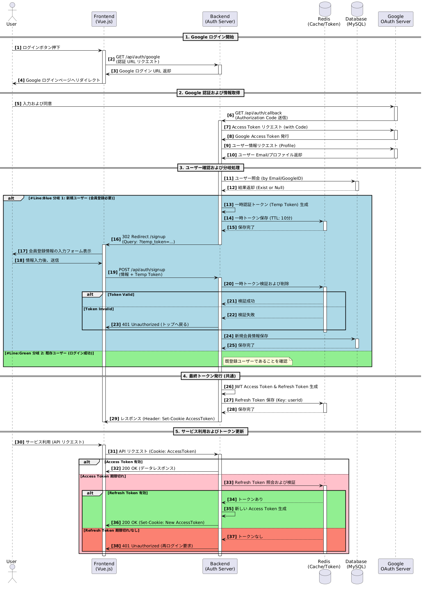

# GSC Portal API

このプロジェクトの README は日本語および韓国語で提供されています。

- [日本語 (Japanese)](README.md)
- [한국어 (Korean)](README_kr.md)

GSC Portal APIは、永進専門大学校グローバルシステム融合科の学生・教授・管理者を対象とした
統合学事管理プラットフォームのバックエンドサーバーです。

## プロジェクト背景

本プロジェクトは、**「学校生活に関するすべての情報を一目で管理したい」** という学生のニーズから開発されました。
従来、学校からのお知らせは主にKakaoTalkを通じて伝達されており、以下のような問題がありました。

1. **情報の分散**
   学年や語学クラスなど、各学生が自分に該当するお知らせや時間割を確認する必要があり、非常に手間がかかっていました。
2. **重要な連絡の見落とし**
   急な休講・補講などのスケジュール変更が十分に伝わらず、見落としてしまうケースもありました。
3. **データの期限切れ**
   時間が経つと過去のお知らせや添付ファイルを再確認できず、後から学習する際に不便でした。

本サービスを通じて、学生は自分のレベルに合った時間割をすぐに確認でき、
過去のお知らせもいつでも簡単に検索・閲覧できるようになります。

## 目標

- **パーソナライズされた情報提供**
  ユーザーの所属（学年・言語）を判別し、必要な情報のみを表示する仕組みを目指します。
- **統合管理プラットフォーム**
  分散していた学事管理機能を一元化し、管理効率の最大化を図ります。

## Members

<table>
  <tr>
    <td align="center">
      <br/>
      <b>キム・ソンシク</b><br/>
      Backend (Leader)<br/>
      <a href="https://github.com/Gapsick">@Gapsick</a><br/>
      <small>時間割、教室、管理者</small>
    </td>
    <td align="center">
      <br/>
      <b>キム・ソングァン</b><br/>
      Backend<br/>
      <a href="https://github.com/ias-kim">@ias-kim</a><br/>
      <small>ログイン、会員登録、プロフィール、<br/>お知らせ、清掃、ダッシュボード、<br/>インフラ構成</small>
    </td>
    <td align="center">
      <br/>
      <b>クォン・ヒョギル</b><br/>
      Frontend<br/>
      <a href="https://github.com/kwonhyukil">@kwonhyukil</a>
    </td>
    <td align="center">
      <br/>
      <b>大井彩夢</b><br/>
      Frontend<br/>
      <a href="https://github.com/ohiayame">@ohiayame</a>
    </td>
  </tr>
</table>

## 技術スタック

### Backend

- **Runtime**: Node.js (Express.js 5)
- **Database**: MySQL (mysql2)
- **Session**: Redis (connect-redis)
- **Authentication**: Google OAuth 2.0 (googleapis)
- **File Storage**: Multer
- **Documentation**: Swagger (swagger-jsdoc, swagger-ui-express)
- **Monitoring**: Sentry (@sentry/node)
- **Scheduling**: node-schedule

### Infrastructure

- **Containerization**: Docker, Docker Compose
- **Development**: Nodemon, dotenv
- **Code Quality**: ESLint, Prettier, Husky, lint-staged
- **CI**: GitHub Actions

<hr style="height:3px; background:#444; border:none;" />

## システムアーキテクチャ

### 全体構成図


GitHub Actionsを通じたCIが実装されており、ビルド完了後に半自動デプロイ方式を使用します。

### ログインプロセス

#### 日本語ダイアグラム


**ログインフロー**:
1. ユーザーがGoogle OAuthログインを試みる
2. Google認証後、コールバックでユーザー情報を受信
3. ユーザー情報をDBに保存/更新
4. Sessionを生成し、Redisに保存
5. ユーザーroleに応じたアクセス権限を付与
   - `PENDING`: 承認待ち（制限されたアクセス）
   - `STUDENT`: 学生権限
   - `PROFESSOR`: 教授権限
   - `ADMIN`: 管理者権限

### データベース設計


**設計原則**:
- **第3正規化ベース設計**: データの冗長性を最小化し、拡張に柔軟な構造
- **状態/履歴データの分離**: 1:N関係で分離し、データ追跡・管理を容易化
- **参照テーブルの活用**: 条件/分類情報を別テーブルに分離し、一貫性を維持
- **ユーザー属性の分離**: 役割/学籍/履修情報を分離し、柔軟な権限管理を実現

主要テーブル:
- **users**: ユーザー情報（学生、教授、管理者）
- **notices**: お知らせおよび添付ファイル
- **timetables**: 正規時間割
- **timetable_events**: 休講・補講スケジュール
- **cleaning_rosters**: 清掃当番割り当て
- **classroom_reservations**: 教室予約
- **classrooms**: 教室情報
- **semesters**: 学期情報

<hr style="height:3px; background:#444; border:none;" />

## 主要機能

### 1. 認証 (Authentication) - 担当: キム・ソングァン

- Google OAuth 2.0ベースのログイン
- 会員登録および承認プロセス
- Sessionベースの認証
- Roleベースのアクセス制御

### 2. プロフィール (Profile) - 担当: キム・ソングァン

- ユーザー情報の照会/修正
- 成績管理

### 3. お知らせ (Notice) - 担当: キム・ソングァン

- お知らせのCRUD
- 学年/タイプ/科目別フィルタリング
- ファイル添付機能

### 4. 清掃 (Cleaning) - 担当: キム・ソングァン

- 清掃当番ロスターの自動生成
- 学年/条件別当番割り当て

### 5. ダッシュボード (Dashboard) - 担当: キム・ソングァン

- メイン画面統合情報提供
- 時間割、お知らせ、清掃当番サマリー

### 6. 時間割 (Timetable) - 担当: キム・ソンシク

- 正規時間割管理
- 休講・補講スケジュール管理
- 日本語特講スケジュール
- 相談スケジュール登録
- クラス分け管理

### 7. 教室 (Classroom) - 担当: キム・ソンシク

- 教室予約システム
- 週末開放申請
- 人数制限設定

### 8. ユーザー管理 (Admin) - 担当: キム・ソンシク

- ユーザー承認/拒否
- ユーザーrole変更
- 外部メール登録
- 学期/教室管理

<hr style="height:3px; background:#444; border:none;" />

## API ドキュメント

本プロジェクトはSwaggerベースでAPIドキュメントを管理しています。
ローカル環境でサーバーを実行すると、`/api-docs`パスから確認できます。

※ 現在、運営サーバーは内部ネットワークからのみアクセス可能で、
外部からはAPIドキュメントに直接アクセスできません。

サーバー起動後:
- **API サーバー**: http://localhost:3000
- **Swagger ドキュメント**: http://localhost:3000/api-docs

<hr style="height:3px; background:#444; border:none;" />

## 実行方法

```bash
# 開発サーバー実行
npm run dev

# 本番サーバー実行
npm start

# Docker環境実行
npm run docker:dev
```

サーバー起動後:
- **API サーバー**: http://localhost:3000
- **Swagger ドキュメント**: http://localhost:3000/api-docs

<hr style="height:3px; background:#444; border:none;" />

## プロジェクト構成

```
src/
├─ controllers/        # ビジネスロジック処理
│  ├─ auth/           # 認証関連コントローラー
│  ├─ modal/          # モーダル関連コントローラー
│  ├─ adminController.js
│  ├─ classroomController.js
│  ├─ cleaningController.js
│  ├─ dashboardController.js
│  ├─ fileController.js
│  ├─ noticeController.js
│  └─ timetableController.js
├─ routes/            # API ルーティング
│  ├─ modal/
│  ├─ adminRouter.js
│  ├─ authRouter.js
│  ├─ classroomRouter.js
│  ├─ cleaningRouter.js
│  ├─ dashboardRouter.js
│  ├─ fileRouter.js
│  ├─ healthRouter.js
│  ├─ noticeRouter.js
│  └─ timetableRouter.js
├─ service/           # ビジネスロジックサービス
│  ├─ modal/
│  ├─ admin-service.js
│  ├─ auth-service.js
│  ├─ classroom-service.js
│  ├─ cleaning-service.js
│  ├─ dashboard-service.js
│  ├─ file-service.js
│  ├─ notice-service.js
│  └─ timetable-service.js
├─ middleware/        # Express ミドルウェア
│  ├─ authWithRole.js      # 権限検証
│  ├─ errorHandler.js      # エラーハンドリング
│  └─ fileMiddleware.js    # ファイルアップロード
├─ models/            # データモデル
├─ db/                # データベース接続
├─ docs/              # Swagger 設定およびダイアグラム
├─ errors/            # カスタムエラークラス
├─ utils/             # ユーティリティ関数
├─ app.js             # Express アプリ初期化
└─ server.js          # サーバー実行
```

<hr style="height:3px; background:#444; border:none;" />

## コード規則

- **ESLint + Prettier** 適用
- **セミコロン(;)** 必須
- **ダブルクォート(")** 使用
- **インデント**: スペース2個
- **コミット前**: `npm run lint:fix` 実行

<hr style="height:3px; background:#444; border:none;" />

## コミット規約

- ✨ feat: 新機能追加
- 🐛 fix: バグ修正
- 📚 docs: ドキュメント修正
- 💅 style: コードフォーマット
- ♻️ refactor: リファクタリング
- 🔧 chore: その他作業

<hr style="height:3px; background:#444; border:none;" />

## プロジェクト振り返り

### 1. 問題認識: 機能単位開発の盲点

企画されたUIフローは明確でしたが、実際の開発は各自が担当する機能の実装に集中しました。
個別機能のテストは通過しましたが、これを一つのサービスとして統合する過程で予想外の依存性問題と副作用を経験しました。

**「各自がうまく作ることと、全体がうまく動くことは違う」** という点をチームプロジェクトを通じて痛感しました。

### 2. 試行錯誤: ロジック中心API vs ユーザー中心フロー

バックエンドの観点では論理的に完璧に分割されたAPIでしたが、実際のフロントエンド連携過程では、ユーザーの一度の行動のために多くのリクエストが必要でした。

技術的な構造も重要ですが、**「APIは結局ユーザーの行動フローを支えるべきだ」** ということを協業過程で学びました。

### 3. 学んだ点と改善方向

技術的な実装にのみ没頭し、機能間の「接続点」や「例外状況」に対するコミュニケーションが不足していた点が心残りです。

今回のプロジェクトを通じて**設計段階でのチームメンバー間のデータフロー共有が開発コストを削減する**ことを実感し、次のプロジェクトではこの部分により多くの時間を投資したいと思います。

<hr style="height:3px; background:#444; border:none;" />

## Frontend Repository

フロントエンドコードは別リポジトリで管理されています:
<a href="https://github.com/gsc-lab/cs25-2-gsc-portal-web">Frontend Repository</a>
