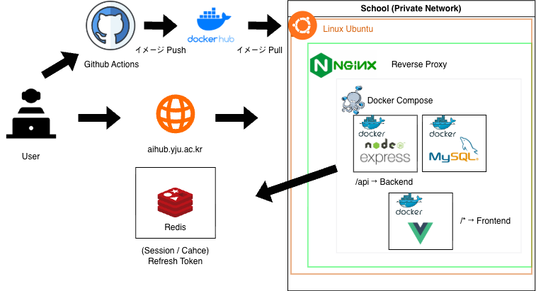
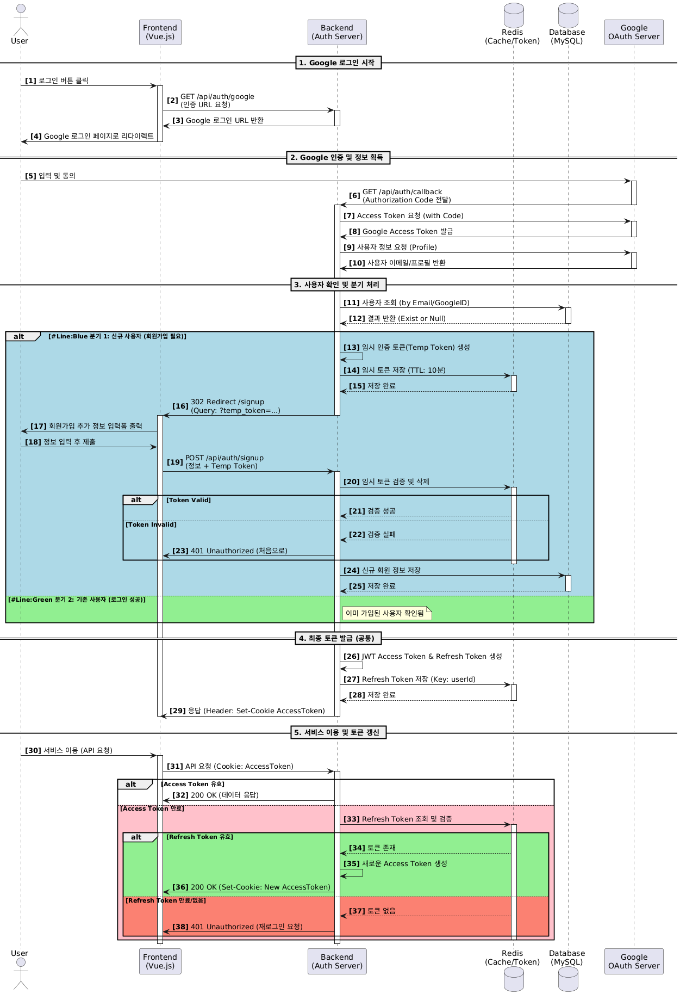
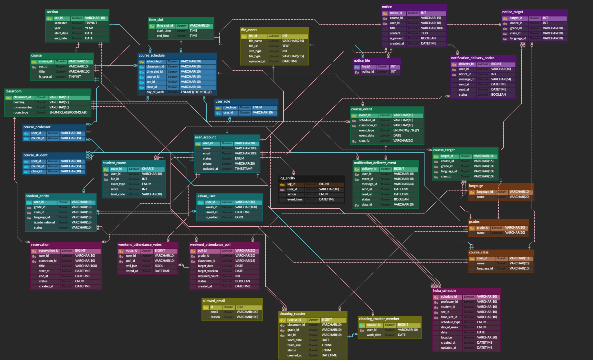

# GSC Portal API

이 프로젝트의 README는 일본어 및 한국어로 제공됩니다.

- [日本語 (Japanese)](README.md)
- [한국어 (Korean)](README_kr.md)

GSC Portal API는 영진전문대학교 글로벌시스템융합과의 학생·교수·관리자를 위한
통합 학사 관리 플랫폼의 백엔드 서버입니다.

## 프로젝트 배경

본 프로젝트는 **"학교 생활에 관한 모든 정보를 한눈에 관리하고 싶다"** 는 학생들의 니즈에서 시작되었습니다.
기존에는 학교 공지사항이 주로 카카오톡을 통해 전달되었으며, 다음과 같은 문제점이 있었습니다.

1. **정보의 분산**
   학년, 어학반 등 각 학생이 해당하는 공지사항과 시간표를 확인해야 하므로 매우 번거로웠습니다.
2. **중요 알림의 누락**
   긴급 휴강·보강 등 일정 변경사항이 충분히 전달되지 않아 놓치는 경우가 있었습니다.
3. **데이터의 휘발성**
   시간이 지나면 과거 공지사항이나 첨부파일을 다시 확인할 수 없어 불편했습니다.

본 서비스를 통해 학생들은 자신의 레벨에 맞는 시간표를 즉시 확인할 수 있으며,
과거 공지사항도 언제든지 쉽게 검색·열람할 수 있게 됩니다.

## 목표

- **개인화된 정보 제공**
  사용자의 소속(학년·언어)을 판별하여 필요한 정보만 표시하는 시스템을 목표로 합니다.
- **통합 관리 플랫폼**
  분산되어 있던 학사 관리 기능을 일원화하여 관리 효율성 극대화를 도모합니다.

## Members

<table>
  <tr>
    <td align="center">
      <br/>
      <b>김성식</b><br/>
      Backend (Leader)<br/>
      <a href="https://github.com/Gapsick">@Gapsick</a><br/>
      <small>시간표, 강의실 투표, 관리자 페이지, 실시간 모니터링 및 장애 대응</small>
    </td>
    <td align="center">
      <br/>
      <b>김성관</b><br/>
      Backend<br/>
      <a href="https://github.com/ias-kim">@ias-kim</a><br/>
      <small>인증 인가 기능, 공지사항, 청소 배정, 대시보드, 인프라 구성</small>
    </td>
    <td align="center">
      <br/>
      <b>권혁일</b><br/>
      Frontend<br/>
      <a href="https://github.com/kwonhyukil">@kwonhyukil</a>
    </td>
    <td align="center">
      <br/>
      <b>오오이 아야메</b><br/>
      Frontend<br/>
      <a href="https://github.com/ohiayame">@ohiayame</a>
    </td>
  </tr>
</table>

## 기술 스택

### Backend

- **Runtime**: Node.js (Express.js 5)
- **Database**: MySQL (mysql2)
- **Session**: Redis (connect-redis)
- **Authentication**: Google OAuth 2.0 (googleapis)
- **File Storage**: Multer
- **Documentation**: Swagger (swagger-jsdoc, swagger-ui-express)
- **Monitoring**: Sentry (@sentry/node)
- **Scheduling**: node-schedule

### Infrastructure

- **Containerization**: Docker, Docker Compose
- **Development**: Nodemon, dotenv
- **Code Quality**: ESLint, Prettier, Husky, lint-staged
- **CI**: GitHub Actions

<hr style="height:3px; background:#444; border:none;" />

## 시스템 아키텍처

### 전체 구성도



GitHub Actions를 통한 CI가 구현되어 있으며, 빌드 완료 후 학교 내부 서버에 접속해 반자동 배포 방식을 사용합니다.

### 로그인 프로세스

#### 한국어 다이어그램


**로그인 흐름**:
1. 사용자가 Google OAuth 로그인 시도
2. Google 인증 후 콜백으로 사용자 정보 수신
3. 사용자 정보를 DB에 저장/업데이트
4. Session 생성 및 Redis에 저장
5. 사용자 role에 따른 접근 권한 부여
   - `STUDENT`: 학생 권한
   - `PROFESSOR`: 교수 권한
   - `ADMIN`: 관리자 권한

### 데이터베이스 설계



**설계 원칙**:
- **3정규화 기반 설계**: 데이터 중복을 최소화하고 확장에 유연한 구조
- **상태/이력 데이터 분리**: 1:N 관계로 분리하여 데이터 추적 및 관리 용이
- **참조 테이블 활용**: 조건/분류 정보를 별도 테이블로 분리하여 일관성 유지
- **사용자 속성 분리**: 역할/학적/수강 정보를 분리하여 유연한 권한 관리

주요 테이블:
- **users**: 사용자 정보 (학생, 교수, 관리자)
- **notices**: 공지사항 및 첨부파일
- **timetables**: 정규 시간표
- **timetable_events**: 휴강/보강 일정
- **cleaning_rosters**: 청소 당번 배정
- **classroom_reservations**: 강의실 예약
- **classrooms**: 강의실 정보
- **semesters**: 학기 정보

<hr style="height:3px; background:#444; border:none;" />

## 주요 기능

### 1. 인증 (Authentication) - 담당: 김성관

- Google OAuth 2.0 기반 로그인
- 회원가입 및 승인 프로세스
- Session 기반 인증
- Role 기반 접근 제어

### 2. 프로필 (Profile) - 담당: 김성관

- 사용자 정보 조회
- 성적 관리

### 3. 공지사항 (Notice) - 담당: 김성관

- 공지사항 CRUD
- 학년/타입/과목별 필터링
- 읽음 처리/읽음 현황 조회
- 파일 첨부 기능

### 4. 청소 (Cleaning) - 담당: 김성관

- 청소 당번 로스터 자동 생성
- 학년/조건별 당번 배정

### 5. 대시보드 (Dashboard) - 담당: 김성관

- 메인 화면 통합 정보 제공
- 시간표, 공지사항, 청소 당번 요약

### 6. 시간표 (Timetable) - 담당: 김성식

- 정규 시간표 관리
- 휴강/보강 일정 관리
- 일본어 특강 일정
- 상담 일정 등록
- 클래스 분반 관리

### 7. 강의실 (Classroom) - 담당: 김성식

- 강의실 예약 시스템
- 주말 개방 신청
- 인원 제한 설정

### 8. 사용자 관리 (Admin) - 담당: 김성식

- 사용자 승인/거부
- 사용자 role 변경
- 외부 메일 등록
- 학기/강의실 관리

<hr style="height:3px; background:#444; border:none;" />

## API 문서

본 프로젝트는 Swagger 기반으로 API 문서를 관리하고 있습니다.  
로컬 환경에서 서버를 실행하면 `/api-docs` 경로를 통해 확인할 수 있습니다.

※ 현재 운영 서버는 내부 네트워크에서만 접근 가능하여,  
외부에서는 API 문서에 직접 접근할 수 없습니다.

서버 실행 후:
- **API 서버**: http://localhost:3000
- **Swagger 문서**: http://localhost:3000/api-docs

<hr style="height:3px; background:#444; border:none;" />

## 프로젝트 구조

```
src/
├─ controllers/        # 비즈니스 로직 처리
│  ├─ auth/           # 인증 관련 컨트롤러
│  ├─ modal/          # 모달 관련 컨트롤러
│  ├─ adminController.js
│  ├─ classroomController.js
│  ├─ cleaningController.js
│  ├─ dashboardController.js
│  ├─ fileController.js
│  ├─ noticeController.js
│  └─ timetableController.js
├─ routes/            # API 라우팅
│  ├─ modal/
│  ├─ adminRouter.js
│  ├─ authRouter.js
│  ├─ classroomRouter.js
│  ├─ cleaningRouter.js
│  ├─ dashboardRouter.js
│  ├─ fileRouter.js
│  ├─ healthRouter.js
│  ├─ noticeRouter.js
│  └─ timetableRouter.js
├─ service/           # 비즈니스 로직 서비스
│  ├─ modal/
│  ├─ admin-service.js
│  ├─ auth-service.js
│  ├─ classroom-service.js
│  ├─ cleaning-service.js
│  ├─ dashboard-service.js
│  ├─ file-service.js
│  ├─ notice-service.js
│  └─ timetable-service.js
├─ middleware/        # Express 미들웨어
│  ├─ authWithRole.js      # 권한 검증
│  ├─ errorHandler.js      # 에러 핸들링
│  └─ fileMiddleware.js    # 파일 업로드
├─ models/            # 데이터 모델
├─ db/                # 데이터베이스 연결
├─ docs/              # Swagger 설정 및 다이어그램
├─ errors/            # 커스텀 에러 클래스
├─ utils/             # 유틸리티 함수
├─ app.js             # Express 앱 초기화
└─ server.js          # 서버 실행
```

<hr style="height:3px; background:#444; border:none;" />

## 코드 규칙

- **ESLint + Prettier** 적용
- **세미콜론(;)** 필수
- **큰따옴표(")** 사용
- **들여쓰기**: 스페이스 2칸
- **커밋 전**: `npm run lint:fix` 실행

<hr style="height:3px; background:#444; border:none;" />

## 커밋 컨벤션

- ✨ feat: 새로운 기능 추가
- 🐛 fix: 버그 수정
- 📚 docs: 문서 수정
- 💅 style: 코드 포맷팅
- ♻️ refactor: 리팩토링
- 🔧 chore: 기타 작업

<hr style="height:3px; background:#444; border:none;" />

## 프로젝트 회고

### UI/UX 관점

개발자 관점으로 설계한 기능과 실제 사용자 흐름 사이에는 차이가 존재한다는 것을 깨달았습니다.
기능은 완성됐지만, 직접 사용해보면서 UI/UX 개선의 필요성을 절실히 체감했습니다.

**핵심 인사이트**:
"어디에 있는지", "어떻게 쓰는지"가 사용자에게 더 중요하다는 점을 인식했습니다.

### 설계 관점

프로젝트가 처음 설계한 흐름대로 진행되기보다는 개발 과정에서 지속적인 수정이 반복되었습니다.
기능이 늘어날수록 초기 구조의 영향이 커진다는 것을 경험했고,
결과적으로 초기 설계가 이후 수정 비용을 크게 좌우한다는 것을 체감했습니다.

### 우리가 얻은 결론

기능 구현보다 중요한 것은 **사용 흐름과 변경을 고려한 초기 설계**입니다.

다음 프로젝트에서는:
- 구현 전에 사용 시나리오·UI 흐름·구조를 먼저 정리
- 실제 사용까지 이어지는 완성도 높은 서비스 구현을 목표로 합니다

<hr style="height:3px; background:#444; border:none;" />

## Frontend Repository

프론트엔드 코드는 별도 저장소에서 관리됩니다:
<a href="https://github.com/gsc-lab/cs25-2-gsc-portal-web">Frontend Repository</a>
